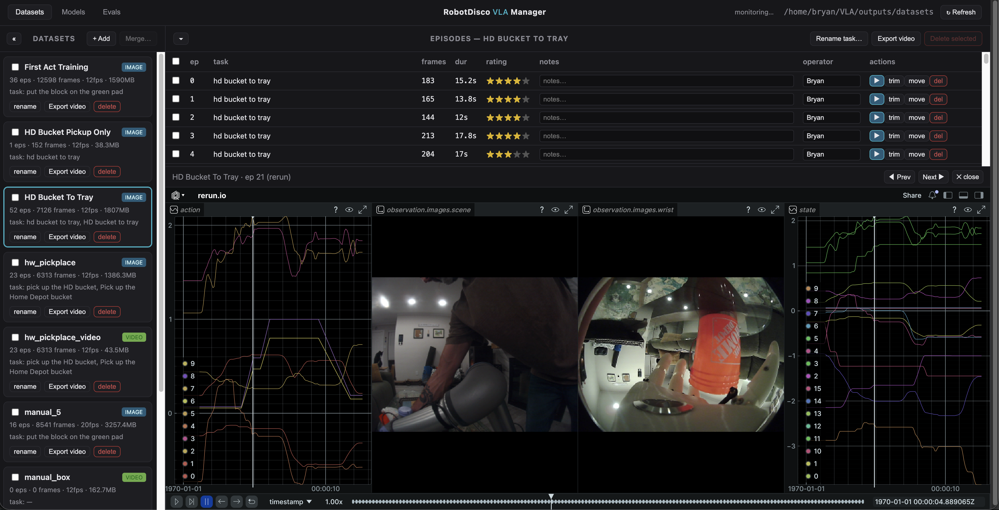
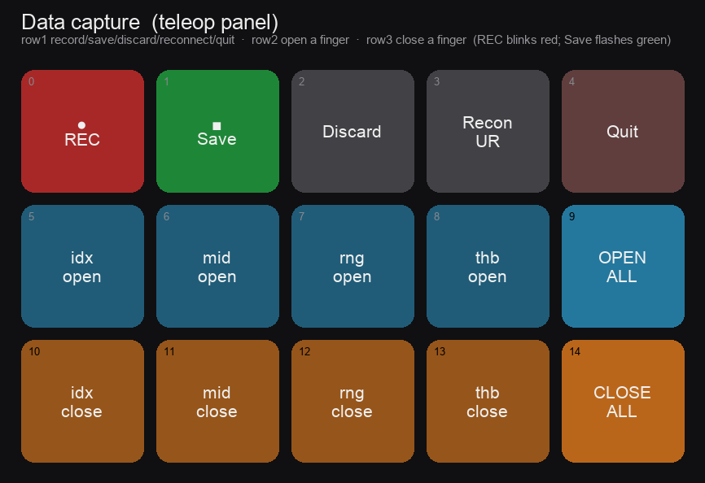

# VLA on UR5e with LeRobot

Experimenting with Vision-Language-Action policies on a Universal Robots UR5e (with an AmazingHand
end-effector), built on [LeRobot](https://github.com/huggingface/lerobot). Simulation-first, now
capturing real-hardware demos: **RTDE** drives the arm for teleop and recording, a browser console
manages the datasets / models / evals, and trained **ACT / SmolVLA** policies deploy back onto the real
robot. ROS 2 is reserved for autonomous deployment.

## Documentation

Full documentation lives in the **[project wiki](https://github.com/r1b4z01d/VLA/wiki)**:

- [Machines & Network](https://github.com/r1b4z01d/VLA/wiki/Machines-and-Network) — the three machines, the isolated robot subnet, and `run.sh`.
- [Hardware Teleop & Recording](https://github.com/r1b4z01d/VLA/wiki/Hardware-Teleop-and-Recording) — the RTDE teleop panel, cameras, Stream Deck, home pose, auto-upload + star rating + auto-home-on-save.
- [Recording Sim Demos](https://github.com/r1b4z01d/VLA/wiki/Recording-Sim-Demos) — MuJoCo teleop capture and the sim grasp aid.
- [Training & Eval](https://github.com/r1b4z01d/VLA/wiki/Training-and-Eval) — train ACT / fine-tune SmolVLA, sim eval, playback, merge/recover.
- [Web Manager (RobotDisco)](https://github.com/r1b4z01d/VLA/wiki/Web-Manager) — the browser console for datasets · models · evals (native or Docker).
- [Deploy on Hardware](https://github.com/r1b4z01d/VLA/wiki/Deploy-on-Hardware) — run a trained policy on the real UR5e (`eval_hw.py`).
- [8-DOF Hand](https://github.com/r1b4z01d/VLA/wiki/8-DOF-Hand) — per-finger flex + abduct (in progress).
- [Sync & Layout](https://github.com/r1b4z01d/VLA/wiki/Sync-and-Layout) — moving code between machines and the repo map.

See also **[ROADMAP.md](ROADMAP.md)** for the full plan and **[docs/decisions.md](docs/decisions.md)**
for open architectural choices.
